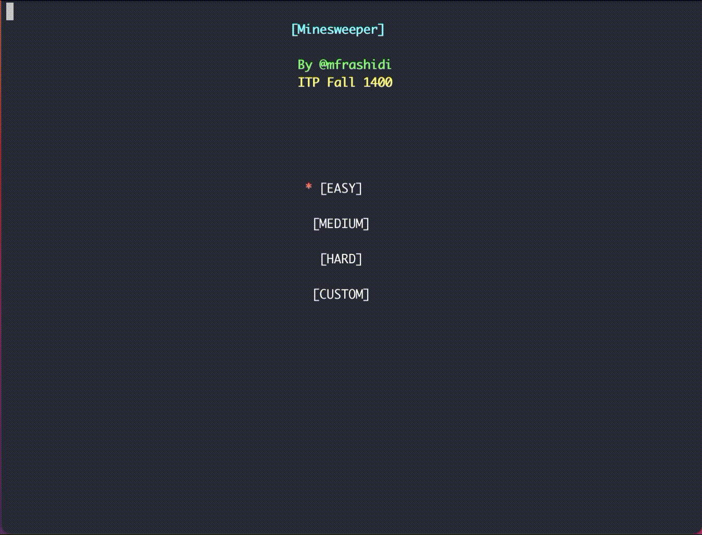

# Minesweeper
This game is completely written in C++ with the help of the [CLUI](https://github.com/SBU-CE/clui) library to make it more beautiful and usable.
> [Graphical version](https://github.com/mfrashidi/minesweeper-gui)
## Installation

1. Clone the repository
```bash
git clone https://github.com/Mfrashidi/minesweeper.git && cd minesweeper
```
2. Compile the game
```bash
make game
```
3. Enjoy :rocket:
```
./play
```

## Game modes

- **Easy:** 5*5 table, 5 bombs
- **Medium:** 10*10 table, 20 bombs
- **Hard:** 15*15 table, 50 bombs
- **Custom:** 5\*5-20\*20 table, 1-399 bombs, Show or hide cell numbers, Set time limit for the game

## How to play
**In-Menu**

| Usage        | Key           |
| ------------- |-------------|
| Change the modes     | &#8593; &#8595; |
| Select a mode      | ENTER      |

**In-Game**

| Usage        | Key           |
| ------------- |-------------|
| Change the cell     | &#8593; &#8595; &#8592; &#8594; |
| Select a cell      | ENTER      |
| Flag a cell      | SPACE      |
| Restart the game      | R      |
| Exit the game      | BACKSPACE      |

**Custom Mode Settings**

| Usage        | Key           |
| ------------- |-------------|
| Select items     | &#8593; &#8595; |
| Change the setting      |&#8592; &#8594;|
| Start the game      | ENTER      |

## TODO :white_check_mark:
- [ ] Add high score history
- [ ] Test and Add Windows support

## Contributing
Pull requests are welcome. For major changes, please open an issue first to discuss what you would like to change.

Please make sure to update tests as appropriate.

## License
[APACHE 2.0](https://choosealicense.com/licenses/apache-2.0/)
